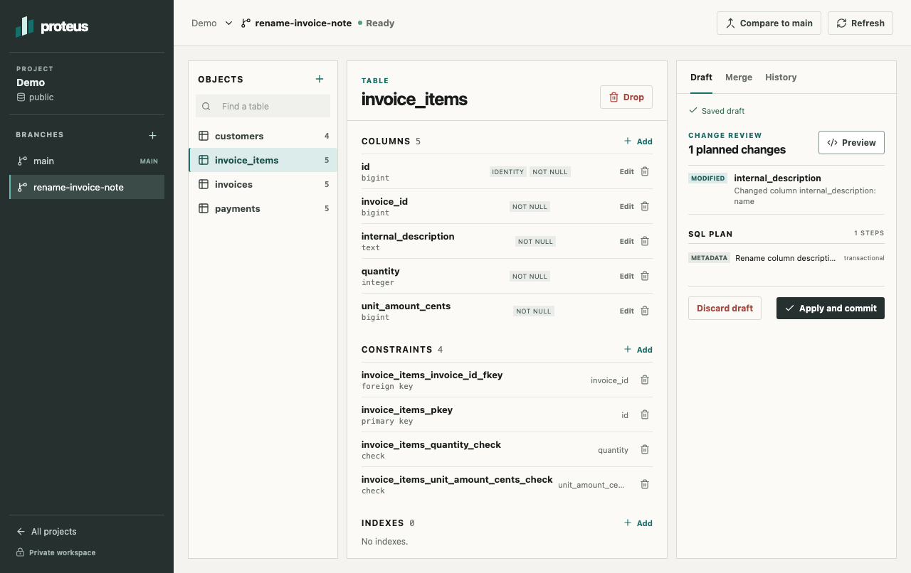

# Proteus

Version control for PostgreSQL schemas.

Branch a schema, review its changes, resolve merge conflicts, and apply the result
to a real database. Self-host with Docker Compose; your database connections and
schema history stay in your deployment.

## Run locally

Docker with Compose is the only requirement for the containerized app.

~~~sh
docker compose up -d --build --wait
~~~

Open [localhost:8000](http://localhost:8000) and choose 'Try sample database', or
connect your own PostgreSQL 17 database. Named volumes keep your work across
container restarts. The hosted reviewer demo is ready for deployment once server
access is supplied; no public URL is available yet.

## Workflow

1. Connect PostgreSQL and save the starting schema.
2. Create a schema-only branch, review draft edits, and apply a revision.
3. Compare the branch with main and resolve conflicts.
4. Apply the merge to main and record the resulting database revision.

Python, FastAPI, Psycopg 3, React, and TypeScript. Real PostgreSQL execution, saved
drafts, rename-aware three-way merges, and target-side migration receipts.

Branches copy schema, not rows. External schema changes after import are out of
scope. Normal data reads and writes remain supported. See the support limits
below and the measured [5 GB benchmark](docs/benchmarks.md).

## Project notes

- [Working and commit rules](AGENTS.md)
- [Decisions and tradeoffs](decisions.md)
- [Requirements and delivery order](docs/requirements.md)
- [Architecture](docs/architecture.md)
- [UI design](docs/design.md)
- [PostgreSQL support limits](docs/compatibility.md)
- [Development and connections](docs/development.md)
- [Tests](docs/testing.md) and [deployment](docs/deployment.md)
- [Demo and interview walkthrough](docs/walkthrough.md)
